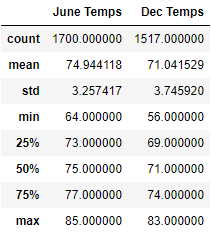

# Surfs_up
## Project Overview
In order to open the surf and ice cream shop business, we need some investors backing to get this off the ground. Therefore, we will provide the analysis reports about the trends of weather in Oahu. Specially, the temperature data for the months of June and December. The investors would base on the analysis reports to determine if the surf and ice cream shop business is sustainable year-round.

## Results
There are the summary statistics of recorded temperature for June and December:
-	The average recorded temperature in both months were very comfortable, which were 75°F in June and 71°F in December.
-	The max and median recorded temperatures were very similar between two months. Besides, the minimum recorded temperature in June is 64°F, which was 8°F more than in December. 
-	Look at the STD and the range values in two months, the distribution in December (STD: 3.75, range: 27) was wider than in June (STD: 3.25, range: 21).  Additionally, there are more outliers in December than in June.

###### Summary Statistics for June vs December

###### June Temperature vs December Temperature

## Summary
